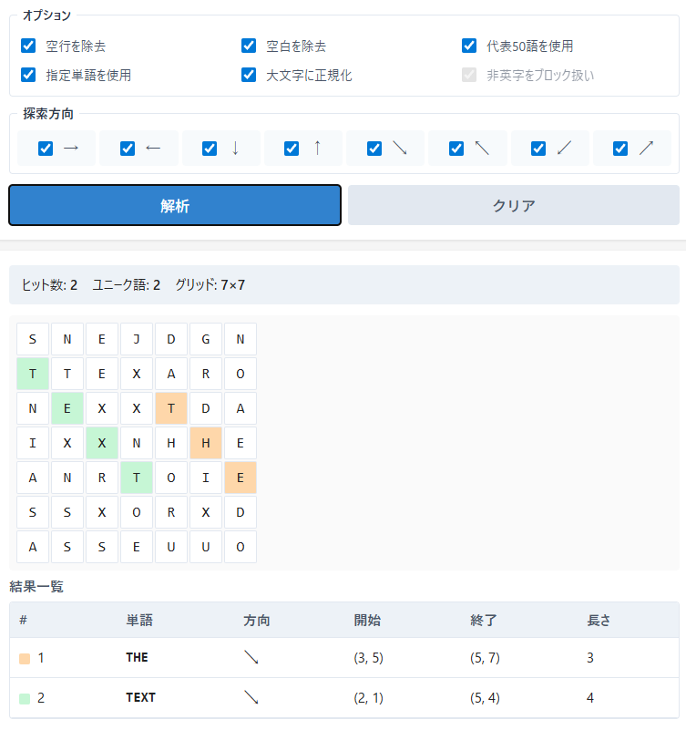

<!--
---
id: day104
slug: stegogrid-explorer

title: "StegoGrid Explorer"

subtitle_ja: "縦・横・斜め・逆方向から隠し単語を探索するグリッド解析ツール"
subtitle_en: "Explore hidden words in text grids from all directions"

description_ja: "複数行テキストを文字グリッドとして扱い、縦・横・斜め・逆方向の全8方向から英単語を探索・可視化するステガノグラフィー解析支援ツール。"
description_en: "A grid-based word exploration tool that scans text in all eight directions to uncover hidden words, designed for steganography and cipher analysis."

category_ja:
  - ワードパズル
  - ステガノグラフィー
category_en:
  - Word Puzzle
  - steganography

difficulty: 1

tags:
  - steganography
  - word-search
  - cipher
  - grid
  - visualization

repo_url: "https://github.com/ipusiron/stegogrid-explorer"
demo_url: "https://ipusiron.github.io/stegogrid-explorer/"

hub: true
---
!-->

# StegoGrid Explorer – 文字グリッド単語探索ツール


[](https://ipusiron.github.io/stegogrid-explorer/)

**Day104 - 生成AIで作るセキュリティツール200**

StegoGrid Explorerは、貼り付けた複数行テキストを「文字グリッド」として扱い、縦・横・斜め・逆方向を含む全8方向から英単語を探索・可視化するWebツールです。

一見ランダムに見えるテキストの中に潜む隠しメッセージや意味のある単語列を、視覚的に発見することを目的としています。

---

## 🌐 デモページ

👉 **[https://ipusiron.github.io/stegogrid-explorer/](https://ipusiron.github.io/stegogrid-explorer/)**

ブラウザーで直接お試しいただけます。

---

## 📸 スクリーンショット

> 
> *暗号解読ゲーム「Cypher」の文字グリッドを解読*

---

## ✨ できること

- 複数行テキストを文字グリッドとして解析
- 以下8方向すべてから英単語を探索
  - 横方向：右（→）、左（←）
  - 縦方向：下（↓）、上（↑）
  - 斜め方向：右下（↘）、左上（↖）、右上（↗）、左下（↙）
- 英語でよく使われる代表的な単語（3文字以上）を自動検出
- ユーザーが指定した任意の単語リストにも対応
- 見つかった単語を以下の形式で可視化
  - グリッド上でのハイライト表示
  - 単語・方向・開始位置・終了位置の一覧表示
  - 複数の単語が見つかった場合は色分けして表示
- 空白や記号をまたいだ誤検出を防止（非英字は探索ブロック扱い）

---

## 🎯 想定ユースケース

- ステガノグラフィー（隠しメッセージ）の入門・学習
- 縦読み・斜め読み・逆読みの検証
- 暗号・CTF・パズル問題の解析補助
- 「偶然に見える文字配置」に意味があるかの確認

---

## 🧩 特徴と設計思想

- 非英字（空白・記号など）をブロック扱い
- 単語をまたがせず、誤検出を防止
- 行長が不揃いなテキストでも解析可能
- 外部ライブラリ不使用のシンプル構成
- 教育・可視化用途を重視したUI

---

## 📖 使い方

1. テキストエリアに複数行の文字列を貼り付ける
2. 必要に応じて探索単語や方向を設定
3. 「Analyze」をクリック
4. グリッドと結果一覧を確認

---

## 📚 代表50語リスト

「代表50語を使用」オプションを有効にすると、以下の英単語が自動的に検索対象となります。

| 3文字 | | | | | | | | | |
|-------|-----|-----|-----|-----|-----|-----|-----|-----|-----|
| THE | AND | FOR | ARE | BUT | NOT | YOU | ALL | CAN | HAD |
| HER | WAS | ONE | OUR | OUT | DAY | GET | HAS | HIM | HIS |
| HOW | MAN | NEW | NOW | OLD | SEE | WAY | WHO | BOY | DID |
| ITS | LET | PUT | SAY | SHE | TOO | USE | KEY | | |

| 4文字 | | | | | | | | | |
|-------|------|------|------|------|------|------|------|------|------|
| CODE | WORD | FIND | HIDE | TEXT | GRID | LINE | OPEN | READ | SEEK |
| TRUE | DATA | | | | | | | | |

---

## 🔧 技術仕様

- HTML / CSS / JavaScriptのみで実装
- クライアントサイド完結（外部通信なし）
- GitHub Pagesで動作
- セキュリティ対策実装済み（CSP、XSS対策）

---

## 📁 ディレクトリー構造

```
stegogrid-explorer/
├── index.html          # メインHTMLファイル
├── script.js           # JavaScriptコード
├── style.css           # スタイルシート
├── README.md           # 本ドキュメント
├── LICENSE             # ライセンスファイル
├── CLAUDE.md           # Claude Code用プロジェクト情報
├── .gitignore          # Git除外設定
├── .nojekyll           # GitHub Pages設定
└── assets/             # 画像リソース
    └── screenshot.png  # スクリーンショット
```

---

## 📄 ライセンス

- ソースコードのライセンスは `LICENSE` ファイルを参照してください。

---

## 🛠️ このツールについて

本ツールは、「生成AIで作るセキュリティツール200」プロジェクトの一環として開発されました。
このプロジェクトでは、AIの支援を活用しながら、セキュリティに関連するさまざまなツールを100日間にわたり制作・公開していく取り組みを行っています。

プロジェクトの詳細や他のツールについては、以下のページをご覧ください。

🔗 [https://akademeia.info/?page_id=44607](https://akademeia.info/?page_id=44607)
